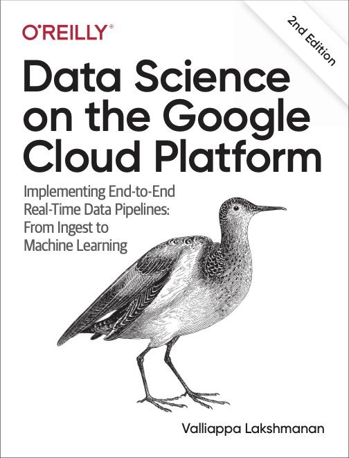

# data-science-on-gcp

Código fuente que acompaña al libro:
Utilizaremos la segunda version

<table>
<tr>
  <td>
  
  </td>
  <td>
  <a href="https://www.amazon.com/Data-Science-Google-Cloud-Platform/dp/1098118952/">Data Science on the Google Cloud Platform, 2nd Edition</a>  
  Valliappa Lakshmanan  
  O'Reilly, Apr 2022
  </td>
  <td>
  Branch <a href="https://github.com/GoogleCloudPlatform/data-science-on-gcp/">2nd Edition</a> [también rama principal (main)]
  </td>
</tr>
<tr>
  <td>
  
  </td>
  <td>
  Data Science on the Google Cloud Platform  
  Valliappa Lakshmanan  
  O'Reilly, Jan 2017
  </td>
  <td>
  Branch <a href="https://github.com/GoogleCloudPlatform/data-science-on-gcp/tree/edition1_tf2">edition1_tf2</a> (obsolete, and will not be maintained)
  </td>
</table>

### Pruebe el código en Google Cloud Platform

El código de Qwiklabs (ver más abajo) se **prueba continuamente** y este repositorio se mantiene actualizado por el estudiante (Bifurcacion para replicacion del trabajo).

Si el código no te funciona, te recomiendo que pruebes el laboratorio de Qwiklab () correspondiente para ver si hay algún paso que te perdiste.
Si aún tiene problemas, deje sus comentarios en Qwiklabs o presente un problema en este repositorio.

### Pruebe el código en Qwiklabs

- [Data Science on the Google Cloud Platform Quest (A la fecha de esta edicion 18-01-2024 solo 3 labs estan disponibles)](https://google.qwiklabs.com/quests/43)
- [Data Science on Google Cloud Platform: Machine Learning Quest (para tener acceso se necesitan credenciales comunicarse con agentes de google)](https://google.qwiklabs.com/quests/50)

### Actualizaciones al libro
El autor actualizó el libro en noviembre de 2019 con TensorFlow 2.0, Cloud Functions y BigQuery ML.
